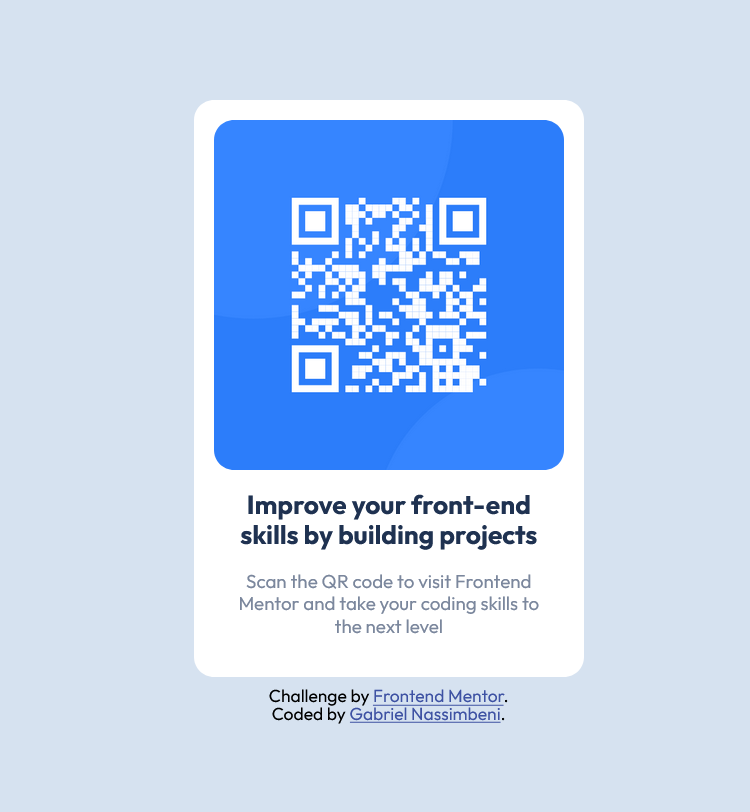

# Frontend Mentor - Gabriel Nassimbeni QR code component solution

This is a solution to the [QR code component challenge on Frontend Mentor](https://www.frontendmentor.io/challenges/qr-code-component-iux_sIO_H).

## Table of contents

- [Overview](#overview)
  - [Screenshot](#screenshot)
  - [Links](#links)
- [My process](#my-process)
  - [Built with](#built-with)
  - [What I learned](#what-i-learned)
  - [Continued development](#continued-development)
  - [Useful resources](#useful-resources)
- [Author](#author)

## Overview

### Screenshot

### Links

- Solution URL: [Github](https://github.com/gabprojects/QR-code-challenge)
- Live Site URL: [Github Pages](https://gabprojects.github.io/QR-code-challenge/)

## My process

### Built with

- CSS custom properties
- Flexbox

### What I learned

I'm a junior developer, each challenge helps me to improve, this one helped me to improve mainly in CSS, writing the formatting of containers, checking if it's better to use margin or padding, alignments with Flexbox to achieve the desired result.

### Continued development

I look forward to completing new challenges and improving my skills, "a smooth sea never made a skilled sailor"

### Useful resources

- [chatGPT](https://chat.openai.com/) - This Ai is always helping me remember commands and learn more about how to program and understand various concepts.

## Author

- Linkedin - [Gabriel Nassimbeni](https://www.linkedin.com/in/gabrieldoc/)
- Frontend Mentor - [@gabprojects](https://www.frontendmentor.io/profile/gabprojects)